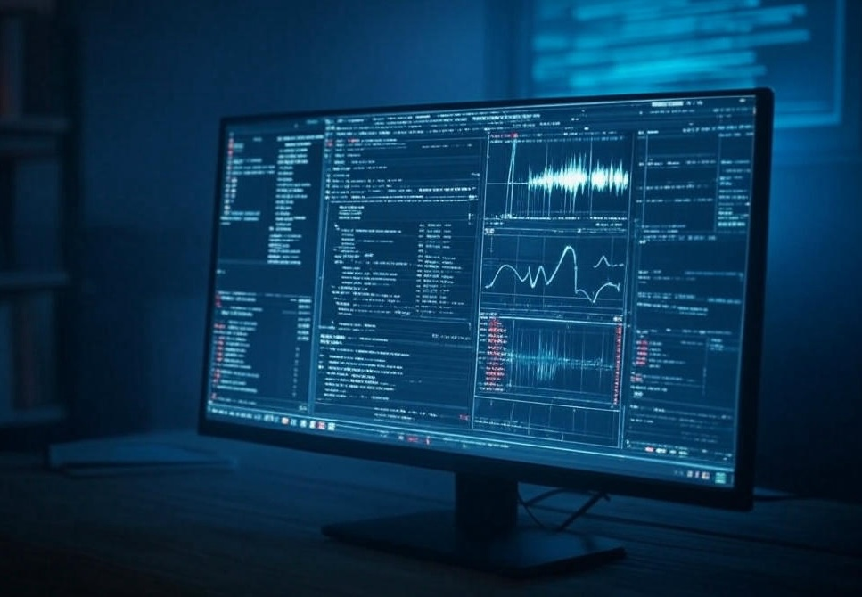

# impulse-response-audio-files



There wasn't a great source of pure `.wav` files of impulse response files. So I decided to start compiling them here. 

These are useful in music production in convolutional reverb plugins/VSTs, but also in creating augmentations on training sets for audio neural networks!

I have pruned datasets to keep the selections from each small, diverse, and high quality.

> NOTE: Each dataset has a different license. Check on `README.md` in each folder and please abide by it!

## Quickstart

```bash
# Clone the repo! this will be your IR directory
git clone git@github.com:worldveil/impulse-response-audio-files.git ./free_impulse_responses

# or alternatively, if you'd like as a part of your repository as a submodule
mkdir -p ./your/path/here/
git submodule add git@github.com:worldveil/impulse-response-audio-files.git ./your/path/here/

# install python packages
cd ./your/path/here
pip install -r requirements.txt
```

and then in Python:

```python
from audiomentations import Compose, ApplyImpulseResponse

# any .wav files in this directory will be chosen uniformly at random
# if the `ApplyImpulseResponse` augmentation is selected
IMPULSE_RESP_DIR = "./path/to/this/repo"

# or, if you prefer a more specific folder, like just EchoThief Venues, you can specify it like so:
#IMPULSE_RESP_DIR = "./path/to/this/repo/echo_thief/Venues"

# define your audio augmentations pipeline
augmentation_pipeline = Compose([
    # Add whatever transforms here you like...
    #AddGaussianNoise(min_amplitude=0.001, max_amplitude=0.015, p=0.5),
    #TimeStretch(min_rate=0.8, max_rate=1.25, p=0.5),
    #PitchShift(min_semitones=-4, max_semitones=4, p=0.5),
    ApplyImpulseResponse(ir_path=IMPULSE_RESP_DIR, p=1.0)
])

# load an example wav for a source sound
speech, sr = torchaudio.load(download_asset("tutorial-assets/Lab41-SRI-VOiCES-src-sp0307-ch127535-sg0042-8000hz.wav"))

# apply the augmentation pipeline
augmented_speech = augmentation_pipeline(speech, sample_rate=sr)

# save it to check it out
torchaudio.save("speech.wav", speech, sample_rate=sr)
torchaudio.save("speech_with_ir.wav", torch.tensor(augmented_speech), sample_rate=sr)

# if you'd like to see the particular IR file that was applied, check here!
for transform in augmentation_pipeline.transforms:
    print(f"{transform.__class__.__name__}: {transform.parameters}")
```

## Or, in pure torch...

If you'd just like to do it in torch without the `audiomentions` package:

```python
import torch
import torchaudio
import torchaudio.functional as F
from torchaudio.utils import download_asset

# load speech sample
speech, sr = torchaudio.load(download_asset("tutorial-assets/Lab41-SRI-VOiCES-src-sp0307-ch127535-sg0042-8000hz.wav"))

# apply a RIR
rir_raw, sr = torchaudio.load("./impulse-response-audio-files/voxengo/st_nicolaes_church.wav")

# augment it using fftconvolve()
augmented = F.fftconvolve(speech, rir)

# save to listen 
torchaudio.save("speech.wav", speech, sample_rate=sr)
torchaudio.save("speech_with_ir_fftconvolve.wav", torch.tensor(augmented_speech), sample_rate=sr)
```

## Selection criteria

Many IR datsets consist of hundreds of recordings from a few (or even a single) room, or are for very specifc use cases like binural or spatial audio. 

This is not as useful when trying to perform augmentations on AI training set data for use in real world scenarios. Resources like [RealRIRs](https://github.com/jonashaag/RealRIRs) are lovely, but not really what I needed.

Thus, I have included small, simple, but diverse datasets here. And I often excluded many similar, undifferentiated responses from the same dataset.

## Usage in audio AI / ML

This library is great for applying IR responses as a wholistic part of audio augmentations on the CPU, during batch loading. If you want GPU support, you can use the similar library by the same author, `torch-audiomentations`, but DO beware that you can't use it in a multiprocessing scenario due to some memory leak issues. 

So I elect to simply do my data preprocessing and augmentations on CPU.

Check out [torch tutorial on audio augmentations](https://pytorch.org/audio/stable/tutorials/audio_data_augmentation_tutorial.html#sphx-glr-tutorials-audio-data-augmentation-tutorial-py) as well as the repo for [`audiomentations`](https://github.com/iver56/audiomentations?tab=readme-ov-file#usage-example).
